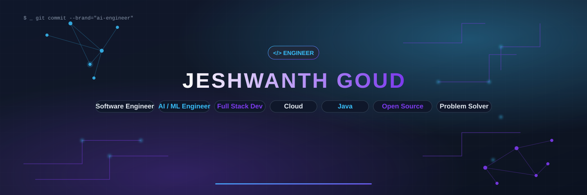
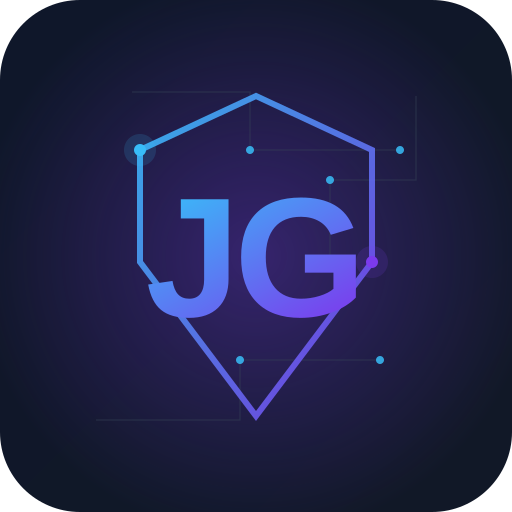

  <picture>
    <source media="(prefers-color-scheme: dark)" srcset="assets/banner/banner.svg">
    
  </picture>

  

<!-- ===================================================================
     🔧 GITHUB USERNAME NOTE
     Replace every `JeshwanthGoud` below with your real GitHub username.
     Replace `jeshwanthgoud` (email/portfolio slugs) where relevant.
==================================================================== -->

  

  <kbd>
    
  </kbd>

 

  
  
  
  
  

---

### 👨‍💻 WHO AM I

> **Full Stack Engineer & AI/ML Explorer** — I design and build resilient backend systems,
> craft intuitive REST APIs, and engineer intelligent, data-driven products.

I am a **Software Engineer** specializing in **full-stack development** with **Java**, **Node.js**, and **React**, and an **AI/ML practitioner** exploring deep learning, RAG workflows, and Agentic AI. My work blends clean architecture, cloud infrastructure, and machine learning to solve real-world problems end to end.

| 🔹 Full Stack | 🔹 Backend Engineering | 🔹 Java & Systems | 🔹 Cloud (AWS) |
| :---: | :---: | :---: | :---: |
| 🔹 AI / ML | 🔹 REST API Design | 🔹 Python & Data | 🔹 Problem Solving |

---

### 🛠️ TECH STACK

**Languages**

-F7DF1E?style=for-the-badge&logo=javascript&logoColor=black)

**Frontend**

**Backend**

**Databases**

**AI / Machine Learning**

**Cloud & DevOps**

**Operating Systems**

---

### 🗺️ JOURNEY & TIMELINE

| Year | Type | Milestone | Detail |
| :---: | :--- | :--- | --- |
| **2026** | 💼 | Internship | Software Trainee — Cloud Computing @ Cloud Technology |
| **2026** | 🏆 | Certification | Oracle Certified Foundations Associate — Agentic AI |
| **2026** | 🚀 | Project | AgriSaarthi — Full-Stack Agricultural Marketplace |
| **2026** | 🧠 | Project | Whole-Heart Segmentation in Medical Imaging (Dice 0.92 / 0.89) |
| **2026** | 🥽 | Project | AI-Powered VR Recommendation System Explorer |
| **2025** | 💼 | Internship | Data Science & AI Intern @ Brainovision Solutions |
| **2025** | 🏅 | Certifications | AWS Cloud Foundations · AWS ML Foundations · IBM Prompt Engineering |
| **2023** | 💻 | Internship | Python Developer Intern @ Pixel Quest |

---

### 💡 FEATURED PROJECTS

<b>🌾 AgriSaarthi — Full-Stack Agricultural Marketplace</b>

 
> Linking farmers and buyers through a secure, scalable digital marketplace with real-time communication.

| Aspect | Details |
| :--- | :--- |
| **Stack** | Node.js · Express.js · PostgreSQL · Redis · Socket.IO · JWT · REST |
| **Architecture** | Monolith with layered route → controller → service → repository pattern; Redis caching layer; PostgreSQL relational schema |
| **Key Features** | JWT Auth · RBAC · Crop Listings · Market Price API · Real-time Chat (Socket.IO) · Rate Limiting · Redis Cache |
| **Challenges Solved** | Enforced security with JWT + RBAC + API rate limiting; scaled reads via Redis caching; handled concurrent real-time messaging |
| **Impact** | Production-grade, secure, and performant end-to-end marketplace |

<b> ❤️ Whole-Heart Segmentation in Medical Imaging (Deep Learning)</b>

> Automated whole-heart segmentation across CT and MRI with deep ensembles and domain adaptation.

| Aspect | Details |
| :--- | :--- |
| **Stack** | PyTorch · MONAI · ResNet-34 · UNet++ · CycleGAN |
| **Architecture** | Encoder-decoder U-Net family with skip connections + synthetic MRI adaptation via CycleGAN |
| **Key Features** | 3D segmentation · Domain adaptation (CT→MRI) · Optimized preprocessing pipelines |
| **Challenges Solved** | Cross-domain distribution shift in MRI; class imbalance via adaptive loss |
| **Impact** | Achieved **Dice 0.92** (MM-WHS) & **0.89** (HVSMR 2.0) cardiac segmentation |

<b> 🥽 VR-Based Personalized Recommendation System Explorer</b>

 
> Immersive 3D recommender system with real-time data retrieval and lightweight content-based filtering.

| Aspect | Details |
| :--- | :--- |
| **Stack** | VR · JavaScript · Real-time data APIs · TIRS algorithm |
| **Core** | Content-based filtering using **Jaccard similarity** over user-item tags |
| **Key Features** | Interactive 3D content · Real-time retrieval · No heavy ML dependency |
| **Challenges Solved** | Latency-optimized recommendations **in real time (≈419 ms)**; smooth interactive experience |
| **Impact** | Accurate, relevant recommendations with a delightful immersive UX |

---

### 📊 GITHUB ANALYTICS

 
 

  
  

  

---

### 🎯 SKILL & EXPERTISE MATRIX

| Domain | Proficiency | Core Strengths |
| :--- | :---: | :--- |
| **Backend Engineering** | ████████████ 85% | Node.js · Express · FastAPI · Java |
| **AI / Machine Learning** | ███████████ 80% | PyTorch · TensorFlow · scikit-learn |
| **Data & Vector Retrieval** | ██████████ 75% | RAG · FAISS · ChromaDB · Transformers |
| **Cloud (AWS)** | ██████████ 75% | EC2 · S3 · IAM · Deployment |
| **REST API Design** | ████████████ 85% | Auth · RBAC · Rate-limiting |
| **Databases** | ██████████ 78% | PostgreSQL · Redis · MySQL |
| **Security Practices** | ████████ 70% | JWT · Access control · Input |
| **Problem Solving** | ████████████ 90% | DSA · Algorithms · Optimization |

---

### 🏅 CERTIFICATIONS

  
  
  
  
  
  

| 🏅 Certification | 🏛️ Issuer | 📅 Year |
| :--- | :--- | :---: |
| Certified Foundations Associate — **Agentic AI** | Oracle University | 2026 |
| **AWS Cloud Foundations** | Amazon (AWS Academy) | 2025 |
| **AWS Machine Learning Foundations** | Amazon (AWS Academy) | 2025 |
| **Prompt Engineering** | IBM | 2025 |
| **Reinforcement & Deep Learning** | IBM | 2025 |
| **Generative AI Fundamentals** | Databricks | 2025 |

---

### 💻 CODING PROFILES

  
  
  

   

  
  

| Platform | Progress | Badge |
| :--- | :---: | :--- |
| **LeetCode** | 300+ Problems Solved | 🟦🟦🟦🟦🟩 |
| **GeeksforGeeks** | 50+ Solved, 400+ Score | 🟦🟦🟦🟨⬜ |

---

### 🎯 CURRENT FOCUS

| 🎓 Learning | 🛠️ Building | 👣 Seeking |
| --- | :---: | :--- |
| System Design & Scalable Architectures | AI-powered SaaS & RAG tooling | Software Engineering Roles |
| Advanced Deep Learning | Cloud-native app on AWS | **Internships & Open Source** |
| Distributed Systems & Microservices | Full-stack AI products | New-geo / remote full-stack work |
| Agentic AI & LLM Workflows | | |

**Currently looking for** &nbsp; 💼 Software Engineering ⚡ AI/ML & Dev 🧠 Open source contributions 〰️

---

### 🌱 OPEN SOURCE & COMMUNITY

I genuinely believe in **learning in public** and giving back through open source.

- 🤝 Regularly explore & contribute to solid open-source projects in **backend tooling**, **AI/ML**, and **developer UX**.
- 🧠 Sharing RAG / LLM experiments, automation scripts, and backend boilerplate with the community.
- 📈 Future contributions aimed at **lowering friction** in AI engineering and cloud ops.

> _My goal: turn experience into reusable libraries and tools other engineers depend on._

---

### 🧙 FUN STRIP

| 💻 | 🧠 | ☕ | 🐧 | ☕ | 🌐 |
| :---: | :---: | :---: | :---: | :---: | :---: |
| Deep focus | Strength in Graphics | Programmer fuel | I <3 Linux | Java <3 | AI <3 |
| `cejimod` said 1440 | doubling count | learned while | `yes billion` | JVM power | intelligence |

  
  

---

### 📬 LET'S CONNECT

  
  
  
  
  

<i>“Code is how I bring ideas to life — clean <b>architecture</b>, smart <b>AI</b>, and delightful <b>full-stack</b> products.”</i>

  

© 2026 · Tanguturi Jeshwanth Goud · Best viewed with a cup of ☕

